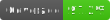

# Zod to mongoose schema converter




> A part of [Zodyac toolbox](https://npmjs.com/org/zodyac).

This package provides a function to convert [zod](https://www.npmjs.com/package/zod) object to [mongoose](https://www.npmjs.com/package/mongoose) schema.

## Installation

```bash
npm i @zodyac/zod-mongoose

pnpm add @zodyac/zod-mongoose

yarn add @zodyac/zod-mongoose

bun add @zodyac/zod-mongoose
```

## Usage

First, extend Zod with ```extendZod```, then create your zod schema:

```typescript
import { z } from "zod";
import { extendZod } from "@zodyac/zod-mongoose";

extend(z);

const zUser = z.object({
  name: z.string().min(3).max(255),
  age: z.number().min(18).max(100),
  active: z.boolean().default(false),
  access: z.enum(["admin", "user"]).default("user"),
  companyId: z.objectId("Company"),
  wearable: z.mongoUUID(),
  address: z.object({
    street: z.string(),
    city: z.string(),
    state: z.enum(["CA", "NY", "TX"]),
  }),
  tags: z.array(z.string()),
  createdAt: z.date(),
  updatedAt: z.date(),
});
```

Then, convert it to mongoose schema and connect model:

```typescript
import { zodSchema } from "@zodyac/zod-mongoose";
import { model } from "mongoose";

const schema = zodSchema(zDoc);
const userModel = model("User", schema);
```

That's it! Now you can use your mongoose model as usual:

```typescript
userModel.find({ name: "John" });
```

> [Note]
```extendZod``` should be called once for the whole application.

## Features

- ✅ Basic types
- ✅ Nested objects and schemas
- ✅ Arrays
- ✅ Enums (strings only)
- ✅ Default values
- ✅ Maps
- ✅ Dates
- ✅ ObjectId
- ✅ ObjectId references
- ✅ ZodAny as SchemaTypes.Mixed
- ✅ Validation using refinement for String, Number, Date
- ✅ Unique for String, Number, Date, ObjectId and UUID

- ⚠️ Record (Being converted to Map)
- ⚠️ Unions (not supported by mongoose, will pick first inner type)

- ❗️ Intersection (not supported by mongoose)
- ❗️ Set (not supported by mongoose)
- ❗️ Indexes (not supported by zod)

- ⏳ Regex validation (coming soon)
- ⏳ instanceOf (coming soon)

## Checking schemas

To make sure nothing is missing, you can use `Schema.obj`:

```typescript
// schema is mongoose schema
console.log(schema.obj);
```

## Raw object

If you want to get raw object from zod schema to modify it, you can use `zodSchemaRaw` function:

```typescript
import { extendZod, zodSchemaRaw } from "@zodyac/zod-mongoose";
import { model, Schema } from "mongoose";

extendZod(z);

const schema = zodSchemaRaw(zDoc);
schema.age.index = true

const model = model("User", new Schema(schema, {
  timestamps: true,
}));
```

## ObjectID and UUID
You can use ```z.objectId(ref?: string)``` and ```z.mongoUUID()``` to describe fields as ObjectID and UUID and add reference to another collection:

```typescript
import { extendZod } from "@zodyac/zod-mongoose";
import { z } from "zod"

extendZod(z);

const zUser = z.object({
  someId: z.objectId(),
  companyId: z.objectId("Company"),
  facilityId: z.objectId().ref("Facility"),
  wearable: z.mongoUUID(),
});
```
## Validation
You can use zod refinement to validate your mongoose models:

```typescript
import { z } from "zod";
import { extendZod, zodSchema } from "@zodyac/zod-mongoose";

extendZod(z);

const zUser = z.object({
  phone: z.string().refine((v) => v.match(/^\d{3}-\d{3}-\d{4}$/), "Invalid phone number"),
});
```

## Unique fields
To make a String, Number or Date unique, call ```.unique()```:
```typescript
import { z } from "zod";
import { extendZod, zodSchema } from "@zodyac/zod-mongoose";

extendZod(z);

const zUser = z.object({
  phone: z.string().unique(),
});

//
```

## Warnings

### ZodUnion types

Union types are not supported by mongoose. If you have a union type in your zod schema, it will be converted to it's inner type by default.

```typescript
const zUser = z.object({
  access: z.union([z.string(), z.number()]),
});

// Will become
// {
//   access: {
//     type: String,
//   },
// }
```

### ZodAny
`ZodAny` is converted to `SchemaTypes.Mixed`. It's not recommended to use it, but it's there if you need it.

### ZodRecord
`ZodRecord` is converted to `Map` type. It's not recommended to use it, but it's there if you need it.

## Contributing

Feel free to open issues and pull requests! Here's a quick guide to get you started:
- Fork the repository
- Install linter and formatter for VSCode: Biome
- Install dependencies: ```npm i```
- Make changes
- Run tests: ```npm test```
- Run linter: ```npm run lint``` (fix with ```npm run lint:fix```)
- Commit and push your changes
- Open a pull request

## License

MIT
